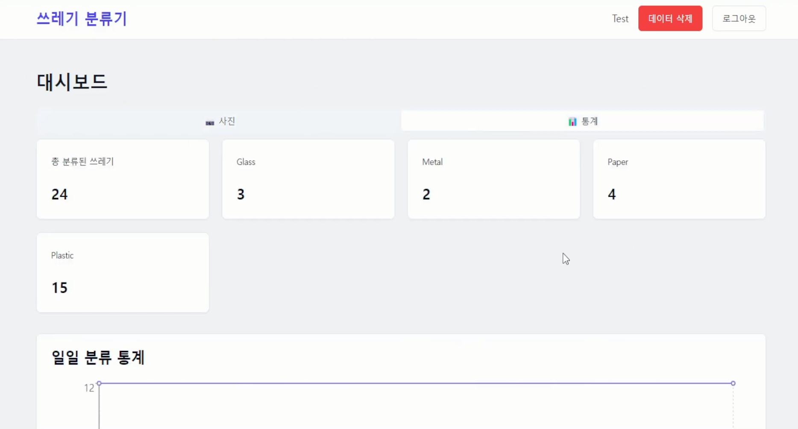

# Garbage Classifier

> 웹캠 기반 실시간 쓰레기 분류 시스템 - PyTorch와 ResNet-50을 활용한 재활용 쓰레기 자동 분류 프로젝트

[]()
[]()
[]()
[]()
[]()

## 📝 목차
- [프로젝트 개요](#프로젝트-개요)
- [시스템 구성도](#시스템-구성도)
- [주요 기능](#주요-기능)
- [기술 스택](#기술-스택)
- [실행 방법](#실행-방법)
- [데이터셋](#데이터셋)
- [대시보드](#대시보드)

## 프로젝트 개요
Garbage Classifier는 실시간 웹캠 영상을 통해 재활용 쓰레기를 자동으로 분류하고 데이터를 관리하는 시스템입니다. PyTorch와 ResNet-50 아키텍처를 기반으로 한 딥러닝 모델을 사용하여 높은 정확도의 쓰레기 분류를 실현하였으며, 분류된 데이터는 자동으로 데이터베이스에 저장되어 관리됩니다.

## 시스템 구성도
```text
Frontend (React + TypeScript)
          ↕
    Backend (Node.js)
          ↕
AI Model (Python + PyTorch)
          ↕
   Database (MariaDB)
```

## 주요 기능
- **실시간 쓰레기 분류**
  - 웹캠을 통한 실시간 이미지 캡처
  - ResNet-50 기반 딥러닝 모델을 통한 쓰레기 종류 분류
  - 분류 결과의 실시간 표시

- **자동 데이터 관리**
  - 분류된 쓰레기 데이터 자동 DB 저장
  - 분류 이력 관리 및 통계 분석
  - 데이터 시각화 대시보드 제공

## 기술 스택
### Frontend
- React
- TypeScript

### Backend
- Node.js
- Python

### AI Model
- PyTorch
- ResNet-50

### Database
- MariaDB

## 실행 방법
### 분류기만 실행
```bash
python trash_classify.py
```
### 전체 시스템 실행
```bash
npm run dev
```

## 데이터셋
모델 학습에 사용된 데이터셋:
1. [TrashNet Dataset](https://huggingface.co/datasets/garythung/trashnet)
  - 쓰레기 이미지 데이터셋
  - 6개 카테고리의 재활용 쓰레기 이미지 포함

2. [AI Hub 생활폐기물 이미지 데이터셋](https://aihub.or.kr/aihubdata/data/view.do?currMenu=115&topMenu=100&aihubDataSe=realm&dataSetSn=140)
  - 한국의 실제 생활폐기물 이미지
  - 다양한 각도와 조건의 쓰레기 이미지 포함

## 대시보드
### 메인 대시보드


### 통계 화면

